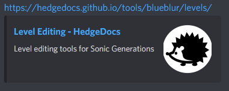

# HedgeDocs

Tools and guides for modding Sonic games. Uses [Material for MkDocs](https://squidfunk.github.io/mkdocs-material/).

# Adding New Pages
Page layout is defined in `mkdocs.yml`. There you can add new pages and sections to HedgeDocs, by pointing the pages to a markdown file. 

## New Page Guidelines
- Be sure to follow the general structure while adding new pages.
- Make sure that each markdown file has a title. The first title in the markdown file is what's going to show up in the webpage's search results.

## Material for MkDocs features
Since HedgeDocs uses Material for MkDocs, you might want to check its [references](https://squidfunk.github.io/mkdocs-material/reference/) to better understand its features. You can use plain markdown, but you can also use admonitions, buttons, and even icons from Font Awesome.

## HedgeDocs specific features
HedgeDocs has a custom theme that allows you to add extra stuff to your pages

### Metadata
You can use MkDocs' metadata support to add descriptions to your pages. This way, the description will show up when the link is embedded. 

Example:
```
---
description: This is the description for this page.
---

# Page Title

content
(...)
```

Result:




# Testing
You can test your changes locally before committing. To do so:

- Install [Python](https://www.python.org/downloads/)
- Install Material For MkDocs: `pip install mkdocs-material`
- Serve webpage locally: `mkdocs serve`
  - You can also build a static site instead, using `mkdocs build`
 
The served webpage will auto refresh whenever you make changes to the files.
