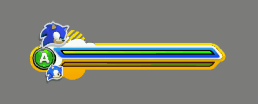
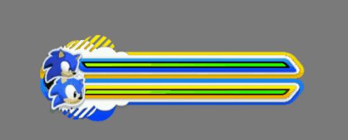
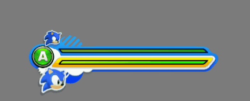
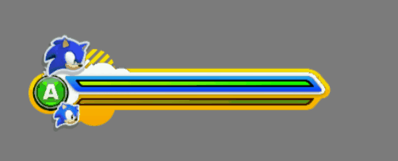

There's some unused HUD animations for Time Eater in <code style="color:red;">bb.cpk/SonicActionCommonHud.ar.00\ui_gameplay.xncp</code>.
Scene called <code style="color:red;">blb_gauge</code> in XNCP file.
## change_c2g:

## change_c2w:

## change_g2c:

## cl_gauge_size_1:

## gn_gauge_size_1:

## Intro_Anim:

