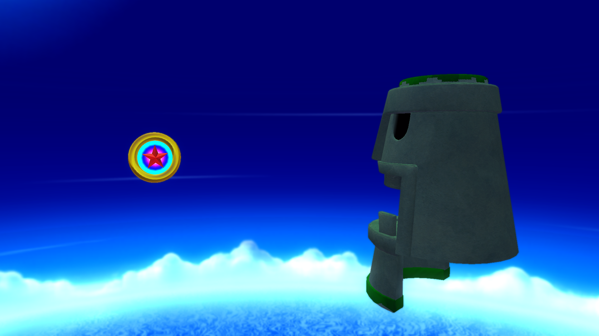
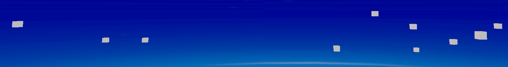

# Original Level Order

## Partial Original Order
Up to a point the game's original level order can be revealed to us by investigating the game's leftover <code style="color: green;">actstgdata.lua</code> file.

``` lua title="actstgdata.lua"
old_stage_all = {
   -- w1
   {
	  title = "w1草原",

	  stages = {
		 {
			name = "w1a01",
			title = "w1-1:グラスヒル",
		 },
		 {
			name = "w1a02",
			title = "w1-2:インディ洞窟",
		 },
		 {
			name = "w1a03",
			title = "w1-3:月光",
		 },
		 {
			name = "w1a04",
			title = "w1-4:大ナール軍",
		 },
		 {
			name = "w1a05",
			title = "w1-5:モアイ",
		 },
		 {
			name = "w1c01",
			title = "w1-A:キン斗雲",
		 },
	  },
   },
   -- w2
   {
	  title = "w2砂漠",

	  stages = {
		 {
			name = "w2a01",
			title = "w2-1:サンドワーム軍",
		 },
		 {
			name = "w2a02",
			title = "w2-2:スカイチェイス",
		 },
		 {
			name = "w2a03",
			title = "w2-3:古代都市",
		 },
		 {
			name = "w2a04",
			title = "w2-4:タカアシガニ",
		 },
		 {
			name = "w2a05",
			title = "w2-5:サンドワーム体内",
		 },
		 {
			name = "w2a06",
			title = "w2-6:竜巻",
		 },
		 {
			name = "w2c01",
			title = "w2-A:黄色三連バネ",
		 },
	  },
   },
   -- w3
   {
	  title = "w3南国",

	  stages = {
		 {
			name = "w3a01",
			title = "w3-1:南国ビーチ",
		 },
		 {
			name = "w3a03",
			title = "w3-3:フルーツ農園",
		 },
		 {
			name = "w3a07",
			title = "w3-7:南国ビーチ2",
		 },
	  },
   },
   -- w4
   {
	  title = "w4雪",

	  stages = {
		 {
			name = "w4a01",
			title = "w4-1:軍事工場",
		 },
		 {
			name = "w4a02",
			title = "w4-2:インディ洞窟2",
		 },
		 {
			name = "w4a03",
			title = "w4-3:ilomiloお菓子",
		 },
	  },
   },
   -- w5
   {
	  title = "w5ジャングル",

	  stages = {
		 {
			name = "w5a01",
			title = "w5-1:ジャングル軌道施設",
		 },
	  },
   },
}
```

Many of these levels have been deleted. However, there's plenty of changes we can dissect in this list.

### Windy Hill
| Final  | Original |
| ------ | -------- |
| w1a01  | w1a01    |
| w1a03  | w1a02    |
| xind01 | w1a03    |
| w1a06  | w1a04    |
|        | w1a05    |
|        | w1c01    |

#### w1a02
Starting off just like the final, it swiftly changes gears by heading into <code style="color: red;">w1a02</code> instead of <code style="color: green;">w1a03</code>.
However, checking the description of the level (インディ洞窟), it matches up with the final game's <code style="color: green;">xind01</code> suggesting the two stages are one and the same, however the starting positions don't line up.

|          xind01          |            w1a02          |
| ------------------------ | ------------------------- |
| { -25.0, -43.3, 1328.6 } | { 50.1, -10.55, -188.27 } |

#### w1a03
The following level is <code style="color: green;">w1a03</code>, meaning Act 3 and Act 2 were likely swapped around early into development.<br>

#### w1a04
The order then continues with <code style="color: red;">w1a04</code>, which is originally used as Sky Road Act 1. This suggests that this level was meant to be used in Windy Hill, which is supported by the fact that the level shares a very similar look with that area of the game.

#### w1a05
<code style="color: red;">w1a05</code> shares its description (モアイ) with the level <code style="color: green;">xmoa01 (Silent Forest Act 4)</code> suggesting, just like the previous stage, it was to come much sooner into the game, however once again the starting positions don't line up. 

|       xmoa01      |         w1a05       |
| ----------------- | ------------------- |
| { -720, 7070, 0 } | { 80, 10067.96, 0 } |

Looking at <code style="color: green;">xmoa01</code>'s set data reveals a few leftover objects in the sky around <code style="color: red;">w1a05</code>'s spawn position.
This list includes:<br>
4x - ObjPointSoundSource<br>
1x - ObjGiantMoaiOut<br>
1x - ObjGFieldConstant<br>
1x - EventVolumeCameraChange<br>
1x - GPathCamera<br>
1x - GoalRing<br>
1x - SetRigidBody

The spawn position being so close to the GoalRing means the level was more than likely supposed to start close to its end, though not meaning it was a short level as the Moai objects function as warp objects.



#### w1c01 
Finally for Windy Hill there's <code style="color: red;">w1c01</code>. Taking note of the change from `a` to a `c`, it seems this level wasn't meant to be a normal act but a challenge level.<br>
Looking at the description (キン斗雲) once again, it reveals to us that this level is non-other than <code style="color: green;">xnim01 (Hidden World Act 1)</code> from the final game, however once again there's a small difference in starting locations.

|          xnim01          |           w1c01         |
| -------------------------| ----------------------- |
| { 0.00, -100.00,-10.00 } | { 0.00, -95.00, 30.00 } |

Interestingly enough this leaves the final game's second encounter with Zazz in <code style="color: green;">w1a06</code> nowhere to be seen.

### Desert Ruins
| Final  | Original |
| ------ | -------- |
| w2a01  | w2a01    |
| xbee01 | w2a02    |
| xswe01 | w2a03    |
| w2a06  | w2a04    |
|        | w2a05    |
|        | w2a06    |
|        | w2c01    |

#### w2a02
Starting off just like the final, it swiftly changes gears by heading into <code style="color: red;">w2a02</code> instead of <code style="color: green;">xbee01</code>.
However, checking the description of the level (スカイチェイス), it matches up with the final game's <code style="color: green;">xsky01</code>, suggesting the two stages are one and the same, however the starting positions don't line up.
Interestingly enough this level also has the `SKYCHASE` tag, meaning it was a level where you controlled the Tornado just like the final iteration of the stage.

|          xsky01         |             w2a02          |
| ----------------------- | -------------------------- |
| { 0.0, 270.0, 17950.0 } | { 2401.1, 63.06, 3125.81 } |

Test level <code style="color: green;">stg823</code> has the following comment, which is about this level: `w2-2：直径20ｍテスト`.
This comment roughly translates to `World 2-2: 20m Diameter Test`.

#### w2a03
This level sadly does not have a final counterpart in the release of the game. Its description roughly translates to `Ancient City`.

#### w2a05
This level sadly does not have a final counterpart in the release of the game. Its description roughly translates to `Japanese Spider Crab`.

#### w2a03
This level sadly does not have a final counterpart in the release of the game. Its description roughly translates to `Sandworm Body`.

#### w2c01
<code style="color: red;">w2c01</code> is the final level of the original order for Desert Ruins, but it's actually used as Sky Road Act 4 in the final game. The aesthetics of the area does match up with the look of Desert Ruins, so it's quite likely that this level was supposed to be there originally. The description for this level roughly translates to "Yellow Triple Spring", meaning it was very likely going to function like the Yellow Spring levels from Sonic Colors. This is supported by the fact that the Moving Springs in the level behave very similarly to the Yellow Springs in Sonic Colors.

### Tropical Coast
From here on out the original level order becomes very segmented with barely any trace left of it.

| Final  | Original |
| ------ | -------- |
| w3a01  | w3a01    |
| w3a03  |          |
| xsea01 | w3a03    |
| w3a06  |          |
| w6a03  |          |
|        |          |
|        | w3a07    |

#### w3a07
This level sadly does not have a final counterpart in the release of the game. Its description is the same as `w3a01`'s with but it has a `2` at the end.

### Frozen Factory
| Final  | Original |
| ------ | -------- |
| w4a01  | w4a01    |
| w4a04  | w4a02    |
| xcas01 | w4a03    |
| w4a06  |          |

#### w4a02
The second level instead of being <code style="color: green;">w4a04</code> is <code style="color: red;">w4a02</code>.
However, checking the description of the level (インディ洞窟2), it matches up with the final game's <code style="color: green;">xind02 (Silent Forest Act 3)</code> suggesting the two stages are one and the same, however the starting positions don't line up.

|           xind02           |            w4a02          |
| -------------------------- | ------------------------- |
| { 0.00, -49.99, 14663.00 } | { -0.18, -52.03, -73.52 } |

#### w4a03
The third level instead of being <code style="color: green;">xcas01</code> is <code style="color: red;">w4a03</code>.
However, checking the description of the level (ilomiloお菓子), it matches up with the final game's <code style="color: green;">xswe01 (Desert Ruins Act 3)</code> suggesting the two stages are one and the same, however the starting positions don't line up.

|            xswe01            |          w4a03         |
| ---------------------------- | ---------------------- |
| { -590.76, 403.30, 1040.85 } | { -1.08, 3.02, -3.30 } |

Inside the configuration file for the level <code style="color: green;">xswe01</code>, the file is still called <code style="color: green;">w4a03_config.lua</code>, however the `brief` section states it's a configuration file for <code style="color: green;">w2a05</code>.

``` lua title="xswe01_config.lua"
---------------------------------------------------------------
-- @file	w4a03_config.lua
-- @author	Jibiki_Hisae
-- @brief	w2-5 の設定ファイル
-- @data	2012/7/20
---------------------------------------------------------------
```

### Silent Forest
| Final  | Original |
| ------ | -------- |
| w5a01  | w5a01    |
| w5a02  |          |
| xind02 |          |
| xmoa01 |          |

### Sky Road
#### w6a03
The secret level of Tropical Coast in the final game. As most of Sky Roads levels seem to come from elsewhere, it's hard to make a proper judgement on whether the stage would aesthetically belong in Sky Road or not, it does however play very similarly to <code style="color: green;">w6a05</code>, Sky Road's Act 3.<br>
The configuration file for the level does state that it belongs to Sky Road as well.

``` lua title="w6a03_config.lua"
---------------------------------------------------------------
-- @file	w6a03_config.lua
-- @author	Yoshitaka Miura
-- @brief	w6-3 の設定ファイル
-- @data	2012/10/30
---------------------------------------------------------------
```

#### w6a05
Inside the configuration file for the level <code style="color: green;">xnim02</code> the `brief` section states it's a configuration file for <code style="color: green;">w6a05</code>.
``` lua title="xnim02_config.lua"
---------------------------------------------------------------
-- @file	 xnim02_config.lua
-- @author	Yoshitaka_Miura
-- @brief	w6-5 の設定ファイル
-- @data	2013/5/4
---------------------------------------------------------------
```

## Speculative Additions
This section includes educated guesses due to lack of leftover data from the game.

### Tropical Coast
<code style="color: red;">w3a02</code>, <code style="color: red;">w3a04</code>, and <code style="color: red;">w3c01</code> are nowhere to be seen. It's possible that these levels turned into one of the levels that don't start with the world number, or that they didn't exist to begin with. As the stage originally had a 7th act it's possible that is what would have been the equivalent of <code style="color: red;">w3c01</code> in this zone.

#### w3a05
Test level <code style="color: green;">w0a04</code> has the following comment, which is about this level: `w3-5：SVカジノテスト（w0a04）`.
This comment roughly translates to `World 3-5: Sideview Casino Test (w0a04)`. This could mean that <code style="color: red;">w3a05</code> turned into <code style="color: green;">xcas01</code> later on into development, which is housed in Frozen Factory in the final game.

### Frozen Factory
<code style="color: red;">w4a05</code> and <code style="color: red;">w4c01</code> are nowhere to be seen. It's possible that these levels turned into one of the levels that don't start with the world number, or that they didn't exist to begin with. 

### Silent Forest
<code style="color: red;">w5a04</code>, <code style="color: red;">w5a05</code>, <code style="color: red;">w5a06</code> and <code style="color: red;">w5c01</code> are nowhere to be seen.It's possible that these levels turned into one of the levels that don't start with the world number, or that they didn't exist to begin with. 

#### w5a03
The second level of Sky Road in the original game. The overall aesthetic of the level does match up with Silent Forest, which suggests it really did belong to Silent Forest at some point.

### Sky Road
<code style="color: red;">w6a01</code>, <code style="color: red;">w6a02</code>, <code style="color: red;">w6a06</code> and <code style="color: red;">w6c01</code> are nowhere to be seen. It's possible that these levels turned into one of the levels that don't start with the world number, or that they didn't exist to begin with. 

### Lava Mountain
<code style="color: red;">w7a04</code>, <code style="color: red;">w7a05</code> and <code style="color: red;">w7c01</code> are nowhere to be seen. It's possible that these levels turned into one of the levels that don't start with the world number, or that they didn't exist to begin with. 