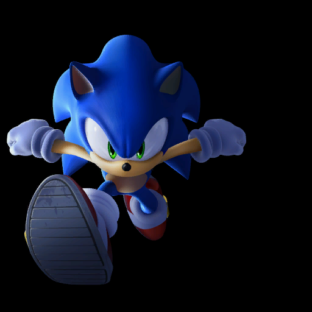

# Leftover Install Assets
There are assets leftover from an installation process. The files and folder related to it are listed below.

``` text
USRDIR
├── Install
│   ├── install_001.dds
│   ├── install_002.dds
│   ├── install_003.dds
│   ├── install_004.dds
│   ├── install_005.dds
│   ├── install_006.dds
│   ├── install_007.dds
│   ├── install_008.dds
├── Install.ar.00
├── Install.arl
├── install.files.xml
└── install.mounts.xml
```

## Install Folder
Within the disk contains a folder named Install, which contains 8 images of several characters in Sonic Unleashed. This folder is also present in the PC port of Sonic Generations, inside `bb2.cpk`.

{width=24%}
{width=24%}
{width=24%}
{width=24%}
{width=24%}
{width=24%}
{width=24%}
{width=24%}

## Install Archive
There is also UI (`ui_install.yncp`) that would have shown during the install process. Despite only being in the PlayStation 3 version of the game, it uses the controller prompts texture from the Xbox 360 version of the game.

Please note that this was recorded using a WIP build of [Shuriken](https://github.com/crash5band/Shuriken), so the preview may not be 100% accurate to how it would look in-game.

<video autoplay loop muted defaultmuted playsinline>
  <source src="../assets/install/ui_install.webm" type="video/webm">
</video>

## PlayStation 3's ICON0 and PIC1
In `install.files.xml` there's information for the game to take `icons/hdd_icon0.png` and `icons/hdd_pic1.png`, and rename them to `ICON0.png` and `PIC1.png` respectively.

``` xml title="install.files.xml"
<System Name="icons/hdd_icon0.png" To="ICON0.PNG"/><System Name="icons/hdd_pic1.png" To="PIC1.PNG"/>
```


