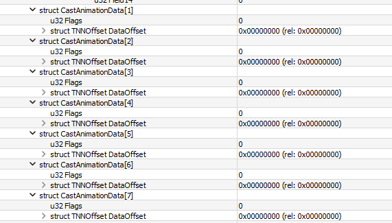

# XNCP Animations
!!! info
    This guide uses the following tools:

    - [010 Editor (with XNCP Template)](/tools/hedgehog-engine/blueblur/files/xncp){ target="_blank"}

XNCP animations for a specific scene are listed in **AnimationDictionary**, which behaves the same way as the CastDictionary:


In **AnimationFrameDataList**, it’s possible to control the amount of keyframes that a specific animation has:


To control the speed of these animations, we have a single field in the scene that controls the frame rate:


**AnimationKeyFrameDataList** contains the information for all the keyframes in the animation, as well as the casts that belong in that animation.


In the screenshot above, we’re seeing the data referring to Animation 0 (**Intro_Anim** when following the dictionary). XNCPs usually follow this naming scheme for animations:

- **Intro_Anim** - Animation that plays when the scene appears
- **Usual_Anim** - Normally a looping animation, is used during the scenes visible state
- **Outro_Anim** - Played before the scene disappears
They can obviously store other animations, and those have their own names.

So, in Intro_Anim, we have several **CastAnimationData**. These control what happens to each cast in this animation. Let’s see what happens to Cast 0 (position, which usually is the parent of all casts in a scene and controls their position)...


Seems like we have flags! It’s a bitfield, and it controls what actually animates in this cast. Here’s the meaning of each bit:
```
0000 0000(0) - Nothing
0000 0001(1) - Hide Flag
0000 0010(2) - X Position
0000 0100(4) - Y Position
0000 1000(8) - Rotation
0001 0000(16) - X Scale
0010 0000(32) - Y Scale
0100 0000(64) - SubImage
1000 0000(128) - Colour Mask
```

So, with this info, we now know what animates in the position cast: It is its X Position.
The **CastAnimationDataSubData1List** is what stores the actual animation data. The amount of entries in this list depends on the number of bits signaled in the **Flags** field. The first entry in the list is referring to the first bit signaled from right to left. So by that logic, the list only has one entry.


And there we go. This entry is what stores the actual **KeyFrames**. Let’s open one up to see how it is.


Scary right? I don’t understand much of what’s going on here, but here we go. 

**Frame** defines which global frame this keyframe is in. Remember **AnimationFrameDataList**? Yeah, this animation has a total of 10 frames, and is played at 60 FPS. For each frame, you define the global frame that it refers to. So, since this cast controls the position of the entire scene, and this is the intro animation, maybe the other keyframe has the frame field set to 10? We’ll see about that shortly.

**Data** store the data of this keyframe. The meaning of data changes depending on the flags. Data can be:

- A position
- An angle (for rotation)
- A size (for X and Y scale)
- An index (for SubImage)
- A colour (for ColorMask)

According to the flags of this specific cast, these keyframes are supposed to control the X Position, which means that “Data” actually represents the X Position of the cast in this frame.

The **Offset** and **Offset2** fields control the casts' Offset position value, where "Offset" is X, while "Offset2" is Y. For example, the buttons in the title screen of Sonic Generations use these values to stay in place when they're clicked since they get scaled up and down.
Let’s look at the second keyframe:


As we suspected, the **Frame** field is now set to 10, meaning this is referring to the last frame in the animation. The value in **Data** has increased, so this means that **this cast slides from left to right** in this animation!

Looking at the remaining **CastAnimationData** entries, we can see that none of them animate, since their **Flags** field is set to 0. So we can conclude that **Intro_Anim** makes the **position** cast slide from **left to right**, and since “position” controls the entire scene, every single cast from this scene slides from left to right in this animation!



## Additional Notes
An animation can only be looped using code, so that can't be controlled via the XNCP. However, **Field00** in **CastAnimationDataSubData** does seem to control how fast a loop occurs, where the value **1** seems to loop it with a delay, while **2** makes it loop smoother.

## Conclusion
Hope I explained XNCP animations well enough. Have fun!

*PS: there’s also AnimationData2List but...*


