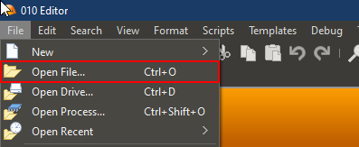
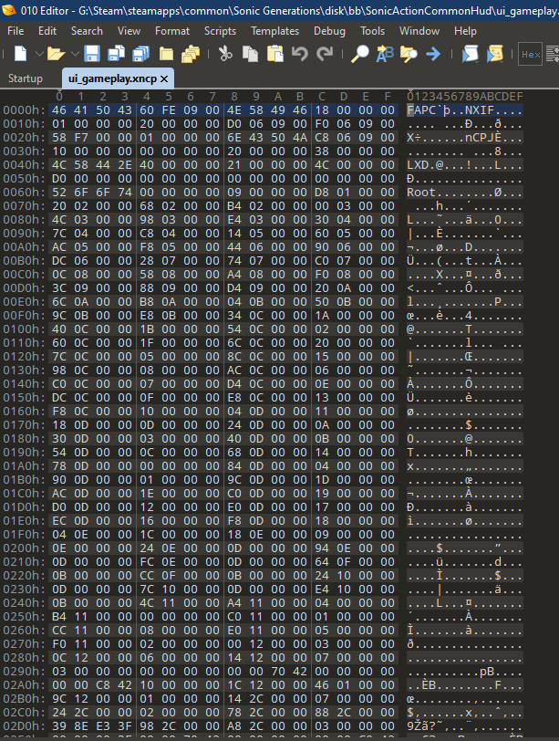
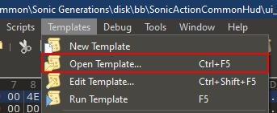
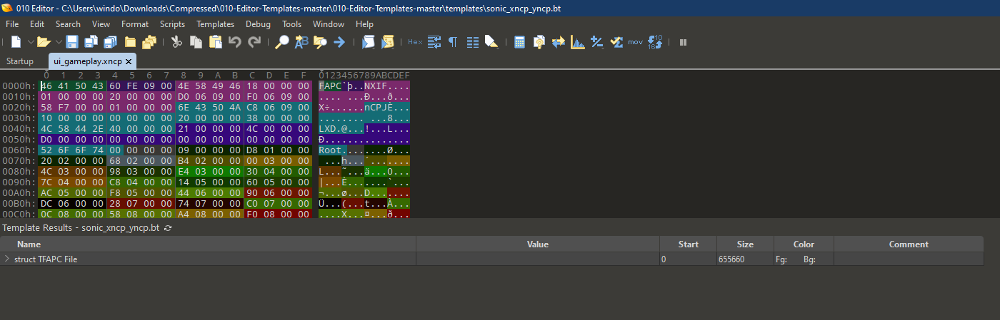
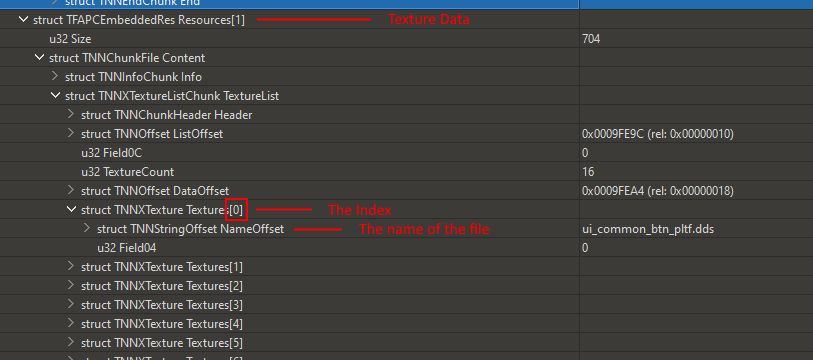

!!! info
    This guide uses the following tools:

    - 010 Editor (with XNCP Template)

    These tools and more can be found in the [XNCP tools page](/tools/hedgehog-engine/blueblur/files/xncp)
# The Basics of XNCP Editing

## Requirements

**XNCP** is the file format of Sonic Generations's UI. In this guide, I'll explain the general things you need to get started.

First of all, you will need to download the [010 Editor](https://www.sweetscape.com/010editor/). This program is used for hex editing, and in our case, to modify XNCP files.
You'll also need to download the [XNCP Template](https://github.com/tge-was-taken/010-Editor-Templates/blob/master/templates/sonic_xncp_yncp.bt); essentially, this file will make it so that you can read and understand the XNCP file's contents, otherwise you'd only see hex numbers, and that's not exactly readable.

## Opening an XNCP file
After installing the 010 Editor, and downloaded the XNCP Template, it's time to open a file.

Open the 010 Editor and click on **File > Open File...**, and open the file that you need to edit.



After opening the file, you'll see a bunch of numbers. Don't get freaked out, this is normal. These are the contents of the XNCP file.



Now, you need to go to **Templates > Open Template...**, and open the file that we downloaded before. It's called **sonic_xncp_yncp.bt**.



After opening the file, a window should pop up with the template's code. You can just ignore this window and hide it wherever you'd like, you won't need to modify this.

Now, go back to **Templates** and click on **Run Template**. This should now make the numbers have colorful backgrounds, and a new window will appear below the hex view.



This new window that has appeared will be your workspace. This'll be the way in which you edit all aspects of a UI file.
Click on the **struct TFAPC File** dropdown, then **struct TFAPCEmbeddedRes Resources[0]**, then **struct TNNNCPJChunk CsdmProject**, and then on **struct TCSDNode Root**. Now  you'll have a few variables here; I'll explain what some of them mean!

## The structure of an XNCP file (Resource 0)

**Scenes** are essentially the containers for a specific group of UI elements, think of it like a folder inside a folder, and you'll need **SceneIDTable** to understand which Scene is what. This table contains the name and index of each Scene (e.g: Scene "gauge" in ui_gameplay.xncp is the "folder" that contains all elements of the boost bar in the HUD).
Scenes also have a few variables that may be of interest, like:

- **ZIndex**, this is essentially the layer in which the UI elements (known as **Casts**) will render
- **Groups**, are exactly what they are called, they are groups of **Casts**
- **SubImages**, these are essentially textures that have been cut in specific portions to be used by Casts
- **CastDictionary**, this will be one of the most useful variables when editing XNCP files, these contain all the names, indexes, and group indexes needed to find a specific Cast in the scene.
- **AnimationKeyFrameDataList**, **AnimationDictionary**, **AnimationFrameDataList**, **AnimationData2List**, all of these control animations. You can read more about them [here](/guides/hedgehog-engine/blueblur/files/xncp/anims)

**And the most important one of all:**

- **Casts**, these are the UI elements of XNCP files, these contain the necessary data to display text, move other elements, or display an image.

## The structure of a Cast
The Cast has several variables that you can change:

- **Field04** controls the type of the cast, these types can be:
```
0 - No Draw (invisible)
1 - Sprite
2 - Font
```
- **IsEnabled** will enable and disable a cast. 0 for disabled and 1 for enabled
!!! info
    If you're disabling a cast, make sure that it does not have children, or it might make the UI look weird!


- **Field0C**, **Field14**, **Field1C**, **Field24** change the positions of the corners of the cast, Top Left, Bottom Left, Top Right, Bottom Right respectively. These only really affect casts that render sprites
- **Offset** changes the position of the element relative to its parent. This is useful for moving elements around.
- **Field30Data** contains most of the fun things that you can edit in a Cast, like:
```
Offset - confusingly, this is an actual offset, compared to the one before which is more like a position
Rotation
Scale
Color - where the variable "Color" will change the main color of the image, and GradientTopLeft,BottomLeft,TopRight,BottomRight will change the colors of the corners of the image
```
- **Field40Data** contains data about a cast's subimages. If the cast is a nodraw or font type, this will be all set to -1 most of the time. Each of these variables is a holder for a specific index of a subimage. However, only the first one is used all the time, all of the other ones are for animations.
  
## The structure of an XNCP file (Resource 1)
Before, I wrote that you needed to go into Resource 0. This is because Resource 0 has most of the cool stuff that you can edit, while Resource 1 contains data about image file locations.

- **TextureList**, this is a list of all the textures used by the UI... this is pretty much it. Each texture will have a name, and it's index will be the number specified next to the "Textures" name.
  



**This was a general introduction to XNCP files, and their structures. For more information, check out the other guides in the sidebar!**