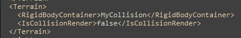

# How To Import Custom Collision in Sonic Generations
!!! info
    This guide uses the following tools:

    - [Sonic GLvl](/tools/hedgehog-engine/blueblur/levels/#sonicglvl){ target="_blank"}
	- [Blender](https://blender.org){ target="_blank"}
	- [HedgeArcPack](/tools/hedgehog-engine/common/files/#hedgearcpack){ target="_blank"}

#### Part 1 (Creating Collision in Blender)
You'll need model for the collision. If you want collision with different parameters (or tags), you'll need special ini file for HavokConverter with tags. You can download it [here](assets/importing-collision/HavokConverter.ini).
Let me show you how to apply tags in your collision: 

First, you need to find mesh on which you want to apply tags. 

Second, you need to add the tag in the end of the name. (for example: level_stone`@STONE`). 

!!! info "Example"
    

You can find other tags in `HavokConverter` if you drop this ini file in `"libgens-sonicglvl-master/bin"`.

#### Part 2 (Importing Your Custom Collision in the Game)
Open `libgens-sonicglvl-master/bin` folder and drop special ini file in it. Open `HavokConverter.exe` and fill:

- Source 3D model files - Your collision model files
- Output file - Directory which will contain the converted collision (add phy.hkx in the end of the name)

Now you can click `Convert` button and wait. 

Next, you'll need to unpack original level's file which is located in the root of .cpk file (for example: <code style="color: green;">#ghz200.ar.00</code>). Unpack it with `HedgeArcPack`, and drop your collision file. Open <code style="color: green;">"Terrain.stg.xml"</code>, find `RigidBodyContainer`, and paste here your collision's name without the extension and save it.

By the way, you can turn on Collision Render to see your collision in-game.

Pack this archive using `HedgeArcPack` and drop it in your mod's folder.

???+info "Root folder"
    

???+info ""disk" folder"
    
