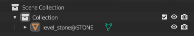
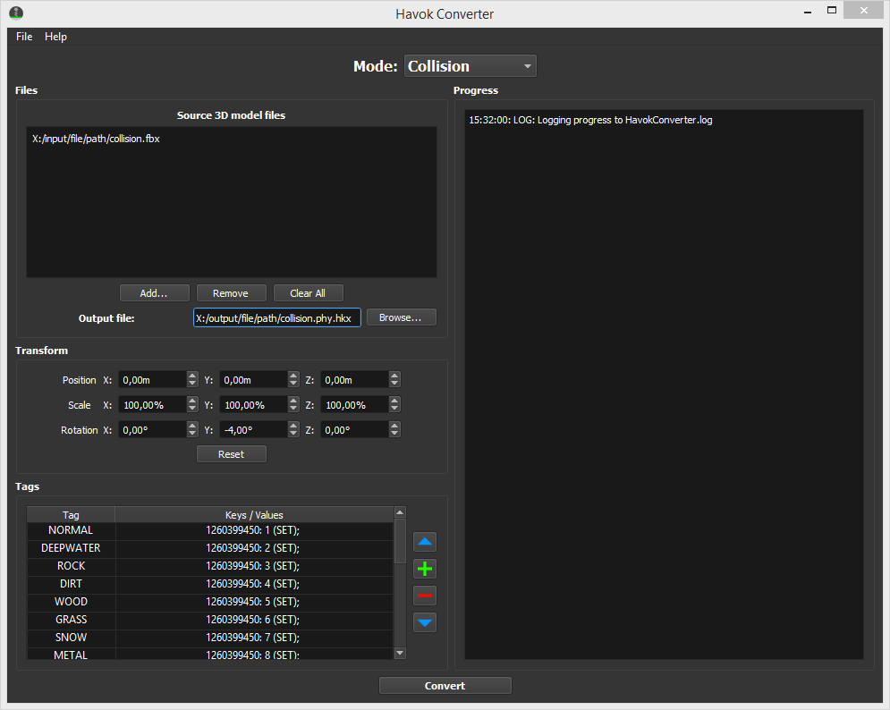
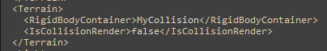
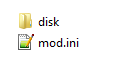

!!! info
    This guide uses the following tools:

    - [Sonic GLvl](/tools/hedgehog-engine/blueblur/levels/){ target="_blank"}
	- [Blender (You can use any other 3D editor)](https://blender.org){ target="_blank"}

# How to import custom collision in Sonic Generations

#### Part 1 (Creating collision in Blender)
You'll need model for the collision. If you want collision with different parameters (or tags), you'll need special ini file for HavokConverter with tags. You can download it [here](https://cdn.discordapp.com/attachments/946312699497840700/982272485858897991/HavokConverter.ini).
Let me show you how to apply tags in your collision: 

First, you need to find mesh on which you want to apply tags. 

Second, you need to add the tag in the end of the name. (for example: level_stone<code style="color: red;">@STONE</code>). 

You can find other tags in HavokConverter if you drop this ini file in <code style="color: green;">"libgens-sonicglvl-master/bin"</code>.

#### Part 2 (Importing your custom collision to the game)
Open "libgens-sonicglvl-master/bin" folder and drop special ini file in it. Open "HavokConverter.exe" and fill:

"Source 3D model files"

"Output file" (add phy.hkx in the end of the name)

Next, you'll need to unpack original level's file which is located in the root of .cpk file (for example: <code style="color: green;">#ghz200.ar.00</code>). Unpack it, and drop your collision file. Open <code style="color: green;">"Terrain.stg.xml"</code>, find RigidBodyContainer, and paste here your collision's name with ".phy" at the end and save it.

By the way, you can turn on <code style="color: green;">Collision Render</code> to see your collision in-game.

Pack this archive and drop it in your mod's folder.

Root folder: 

"disk" folder: 

