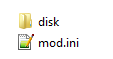
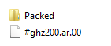

!!! info
    This guide uses the following tools:

    - [Sonic GLvl](/tools/hedgehog-engine/blueblur/levels/){ target="_blank"}
	- [Blender (You can use any other 3D editor)](https://www.blender.org/){ target="_blank"}

# How to import custom terrain in Sonic Generations

#### Part 1 (Creating terrain in Blender)
First off, you need terrain for your level. You can do the terrain yourself, or take already created terrain.
If your level contains transparent materials, find this material, and add <code style="color: red;">"@LYR(trans)"</code> int the end of the name.

You can export your terrain in FBX format. 

#### Part 2 (Importing your level in the game)
Download SonicGlvl, and run <code style="color: green;">"bin/HedgehogConverter.exe"</code>. Fill:

"Source 3D model files"

"Source textures directory"

"Terrain output directory"

Be sure to turn on:

"Generate materials", "Copy and convert materials", "Force tags from Source 3D models' material names as submesh layer" in "Materials".

And turn off:

"Models", "Materials" in "Tags". 

Next, click <code style="color: red;">"Convert"</code> button and just wait. 

After converting, go to your level's directory and extract any .ar archive. After that, extract archives from original level in bb or bb2.cpk/Packed/ folder. I'll be using ghz200 stage.
Take <code style="color: green;">ghz200_Direct01.light</code> and drop this file in your level's archive and save it.
Next, you'll need to unpack # file which is localed in the root of cpk. In my case, it is <code style="color: green;">#ghz200.ar.00</code>. Unpack it, and open <code style="color: green;">"Terrain.stg.xml"</code>, find DataName, paste your light file's name without the extension and save it.

Pack this archive and drop it in your mod's folder.  

Root folder: 

"disk" folder:

"Packed/LevelSlot" folder:

Next up, open your level in SonicGlvl by opening # file, and press Ctrl+A, Delete. It'll delete all the objects from your level. Find <code style="color: green;">"SonicSpawn"</code> in the objects menu and place it anywhere. 
Be sure to set "Active" to "true" in the settings of <code style="color: green;">"SonicSpawn"</code> object. 

After that, press "File" - "Save Stage Data" and "Save Stage Terrain".

#### Part 3 (Creating skybox)

Skyboxes in Sonic Generations is just regular model files. You can take them from the original levels or create them yourself. 
Take your skybox's files and drop them into your level archive. Then, open # file, and open <code style="color: green;">Terrain.stg.xml</code> again. Find Model and paste your skybox's model name here without the extension and save it.

 

But this is only the terrain and skybox, now you need to create collision for your level. You can see this tutorial [here](/guides/hedgehog-engine/blueblur/levels/importing-collision/importing-collision).