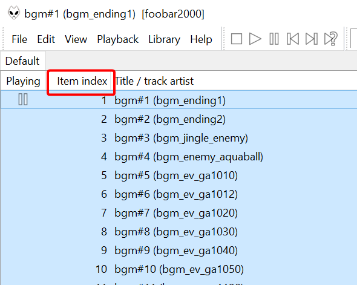
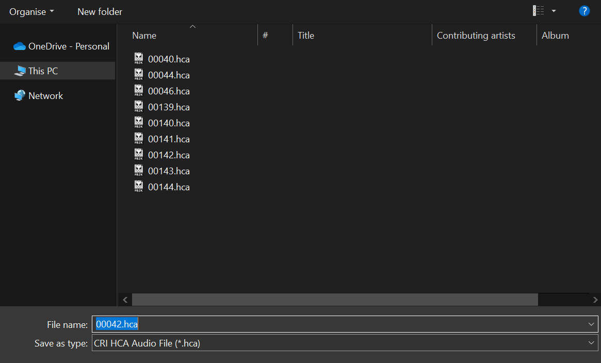
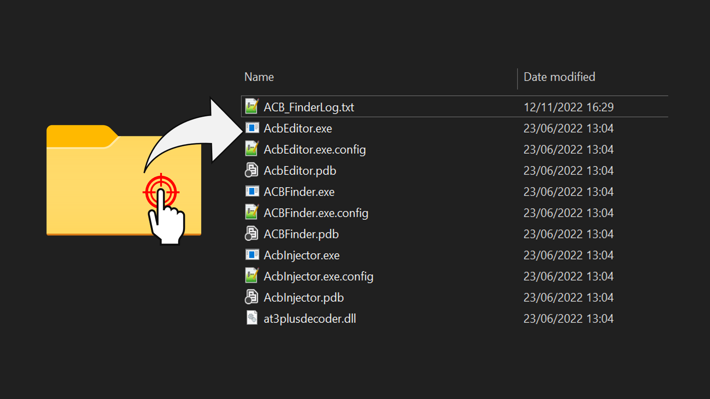

# Replacing Audio

!!! info
    This guide uses the following tools:

    - [foobar2000](https://www.foobar2000.org/){ target="_blank"}
    - [VGStream foobar2000 component](https://dl.vgmstream.org/){ target="_blank"}
    - [SonicAudioTools](/tools/general/audio){ target="_blank"}
    - [VGAudio.Wpf](/tools/general/audio){ target="_blank"}
    - Audio Editing Software of your choice (I use [Audacity](https://www.audacityteam.org/){ target="_blank"})

!!! warning
    This currently does not work while replacing boss music!
    Also, backup any files that you modify unless you are sure of what you are doing!

## What to do
Find the .ACB file containing the audio that you wish to edit and open it up in foobar2000. If there is an accompanying .AWB file, open this instead.

Audio is stored in `SonicFrontiers\image\x64\raw\sound`

Once foobar has opened you will be able to see the names of and listen back to the respective audio files. Make sure that you have the "Item Index" column enabled.

Use ACBEditor.exe found in SonicAudioTools to extract all audio files by dragging and dropping the .ACB onto the exe.

There will now be a folder named the same as the .ACB that will contain .HCA files. The name of the .HCA file will be a 5 digit number that is the Item Index number -1. If you are replacing music it will be a 5 digit number and the word "streaming"

!!! info "Example"
    "1" in the sound effect Item Index would be "00000.hca" and "220" in the music Item Index would be "00219_streaming.hca"
    (Less .HCA files may be extracted than the number of cues shown in the Item Index. Make sure to double check that the .HCA is the sound you wish to change before replacing it)

Create a .WAV file of whatever sound it is you wish to put in game and name it the same as the .HCA file you are going to replace. 

Open VGAudio.Wpf and load the created .WAV file. (If you wish to convert multiple files then go to the batch tab where you will be able to add more files.)

Once the file(s) are loaded, select .HCA on the dropdown menu of file types. Save and replace the file(s) to the folder full of extracted HCA's.

Drag and drop the folder back onto ACBEditor.exe and it will repack the .ACB file with the new audio files.

## Creating looped sounds/music

If you are working with BGM or SFX that loop, you will need to create loop points in the .HCA file. This can be done easily using VGAudio.Wpf.

Follow the same instructions as listed above but when it come to creating the HCA file you will want to drop down the menu that says "Loop File". You will be presented with two boxes, one labelled "Loop Start" and the other labelled "Loop End". The format used in these boxes is Samples which can easily be found in most audio editing software. Find the point in your .WAV file where you would like the sound to start looping and input that number into the "Loop Start" box, then do likewise with "Loop End". From here the process is once again the same as detailed above.

Now you can put Open Your Heart over every boss fight :)