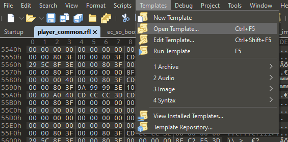
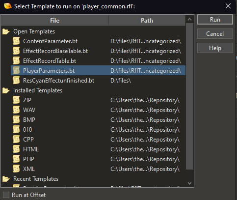
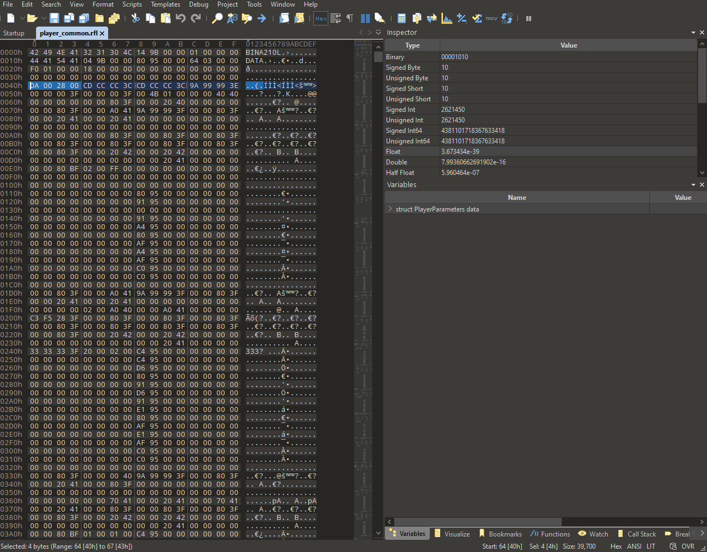
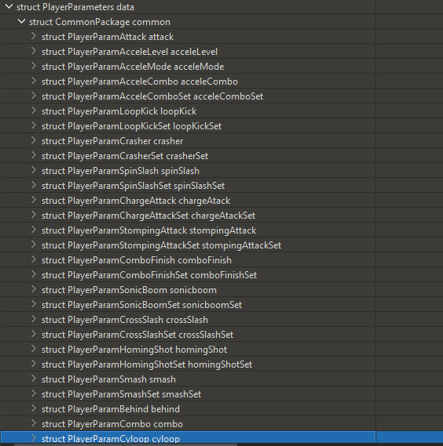
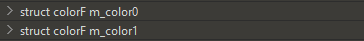
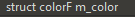
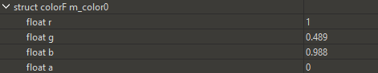
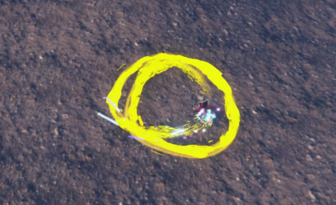

# Replacing Cyloop Color

!!! info
    This guide uses the following tools:

    - [HedgeArcPack](/tools/hedgehog-engine/common/files/#hedgearcpack){ target="_blank"}
    - [010 Editor (with RFL templates)](/tools/hedgehog-engine/rangers/files/rfl){ target="_blank"}

### Getting the File
First you're going to need to drag `playercommon.pac` onto HedgeArcPack.exe to get a playercommon folder. Then, find the `player_common.rfl` file in that folder, and open it in 010 editor.

### Using The Binary Template
You're going to need to use the `PlayerParameters.bt` binary template on 010 editor. This can be done by going to "Templates" at the top and pressing "Open Template" and selecting the `PlayerParameters.bt`

Afterwards, you can press "Run Template" and it should bring up a new window in 010 editor.

!!! info
    If a new window doesn't appear, restart 010 editor or reload `player_common.rfl` into the editor

Run the `PlayerParameters.bt` template and you should see new information in the Variables tab in 010 editor. Split your editor so that you can see your hex values, the inspector tab, and the variables tab all at once.

Now you're ready to hex edit!

### Editing the file
Open `struct PlayerParameters data` in variables, then go into `struct CommonPackage common`, and find `struct PlayerParamCyloop cyloop`

Open the cyloop struct and find `CyloopLocusParameter locus`, this holds the colors for the cyloop across multiple variables. Each color will look like this (there are 3 of these):

...or these (there are 2 of these)

When you open these variables, you will see 4 values, float r, g, b, and a. These values don't make sense so keep up with this:

- Float r is alpha
- Float g is red
- Float b is green
- Float a is blue

Choose a color with its rgb decimal code (ex: Lawn Green is (124,252,0)), then take each of your values and divide them by 255.
!!! info "Example"
    - 124/255 = .489 (red)
    - 252/255 = .988 (green)
    - 0/255 = 0 (blue)

Replace the float values with your new values (you don't need to touch float r), like the example below:

Do this for all of the color struct variables from earlier. This will replace all of the different parts of the cyloop, but you can mix colors for different results, like making some of the cyloop variables red, and some white.

### Saving Your Changes

Once you're happy with your color choices, go to "File"" and save your `player_common.rfl` file. Then, repack your playercommon folder into a .pac file, which you can then use in your mod!

