# Advanced Material Editing

This guide will assume you have at least some understanding of how PBR texturing works.

!!! info
    This guide uses the following tools:

    - [HedgeEdit](https://drive.google.com/file/d/1VDHTpPe1MNVlAYblLsDd3Oa1KpsLqLGs/view){ target="_blank"}
    - [Nvidia Texture Tools Exporter](https://developer.nvidia.com/nvidia-texture-tools-exporter){ target="_blank"}

!!! note
    There is a [Substance Painter Export Template](hhttps://cdn.discordapp.com/attachments/987489054377508924/1044325602452312124/Frontiers_PRM1.spexp){ target="_blank"} if you use Substance to export the PRM map so you don't have to construct it.

## Preparation
This guide expects you to have a model that loads ingame and 5 texture maps for your model:

- An `Ambient Occlusion` Map *(if you do not want this make a solid `1` texture)*
- A `Metallic` Map *(if you do not want this make a solid `0` texture)*
- A `f0 Specular` Map *(if you do not want this make a solid `0.25` texture)*
- A `Roughness` Map *(if you do not want this make a solid `0.8` texture)*
- A `DirectX Normal` Map *(if you do not want this make a solid `1, 1, 0.5` texture)*

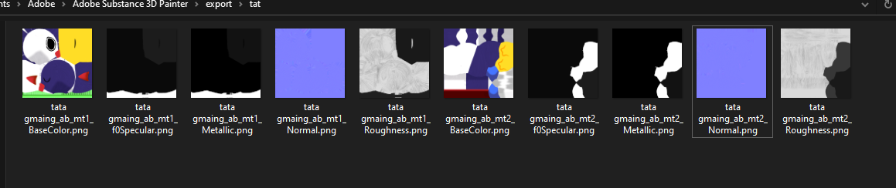

## Making a PRM map
Hedgehog Engine 2 games use some variation of the PRM texture setup, Frontiers specifically uses the `RGBA` setup, `Specular, Smoothness, Metallic, Ambient Occlusion`. So we need to construct a map using our textures, as long as the textures go into the corresponding channels.

### Photoshop
Add your textures besides the `Normal Map` textures as layers in your photoshop document.

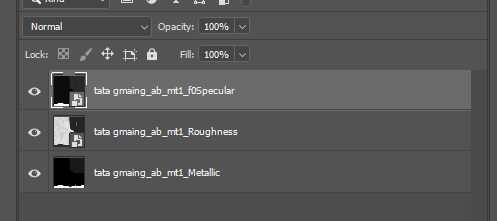

Then open the effects panel and have the **corresponding channel as stated above be the only channel checked**

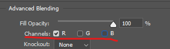

Lastly select your `Roughness` layer and invert it (Ctrl+I). Smoothness in PBR is just inverted roughness.

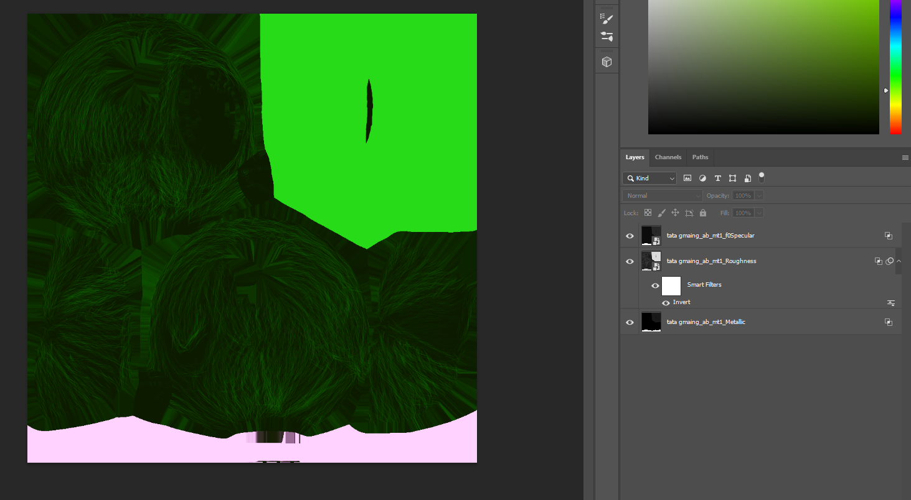

This will be your PRM map. Save it to your work directory.

## Converting PNG to DDS correctly
Open `Nvidia Texture Tools Exporter` and load your texture you want to convert and make sure `BC7` is selected for the `Color` maps, for your `normal` map make sure `BC5u` is selected *(The normal map will show as yellow in the icon, ignore it)*. Then Save As... `.dds`

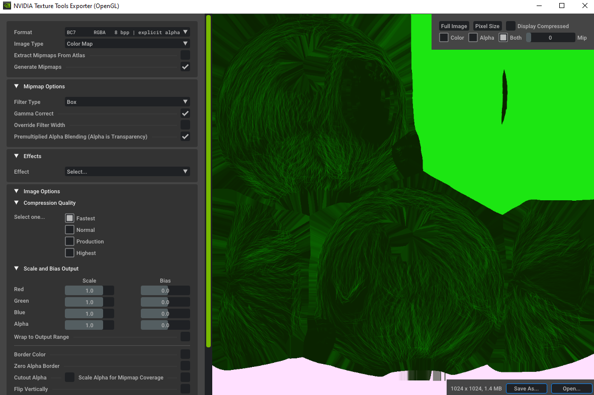

Example

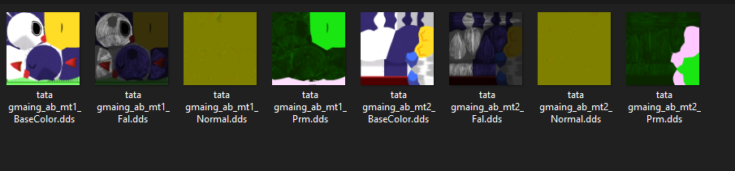

!!! info
    When saving the PRM texture make sure `Premultiplied Alpha Blending` is `unchecked`

    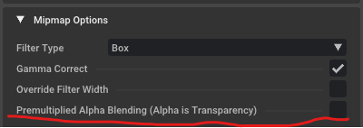

## Editing the Hedgehog Engine 2 materials

your model converter will have made .material files, you may even be using them. **Remember their names and delete them.** It is generally better to modify pre existing materials as it will look better because they include all the shader parameters.

*A good base to modify off of is Sonic's cloth, since it is a common prm shader.*

Duplicate and rename the material file you're building off of to the material name the model converter outputted.

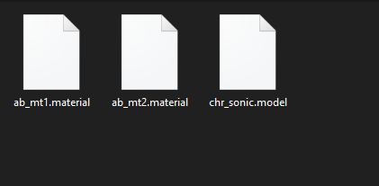

Open HedgeEdit, then navigate to `Edit > Material Editor`

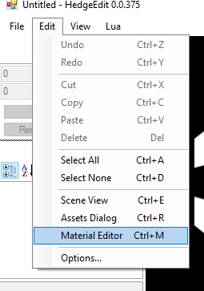

Once the pop up opened use File > Open to open one of the .material file you made. Then hit the ... next to `Textures (Collection)`

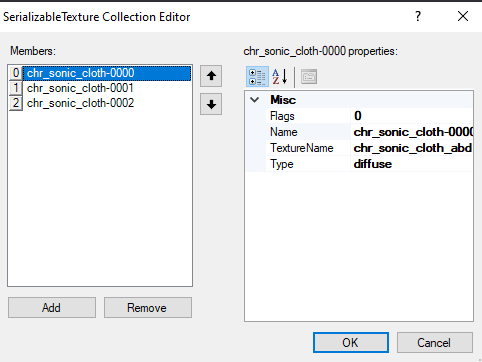

Each of these members are textures the material feeds the shader. What's important is there's 3 and they should correlate to the textures we made earlier.

Select each member and set `TextureName` to the filename of the `.dds` we made earlier **without the file extension**

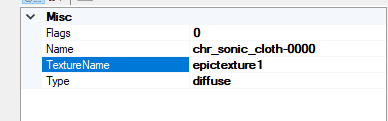

!!! note
    If you chose to edit a nondefault material (IE Sonics fur) you may need to go to the `Parameters` section to get the members for the parameters.

    Usually texture suffixes like `fal` go to falloffs, `flw` flow maps, `fur` noise layer overlayed on the diffuse for the fur.

Save the material then youre done.