# Replacing Video (USM)
!!!info
 Tools Needed:
 
    - [Scaleform Video Encoder](./Tools/Scaleform Video Encoder.7z)
    - [ffmpeg](https://ffmpeg.org/download.html) + [ff-prompt.bat](https://github.com/nightwolf93/Electron-Starter/blob/master/lib/ffmpeg/ff-prompt.bat) 
    - Your video (Needs to be 30FPS, and needs to be under or the same length as the original video.)
    - get the filename of the .USM you are going to replace
 
   Place ff-prompt.bat in the root folder of your ffmpeg folder, and add a folder with the name "video" to the "bin" folder. Place your video (30FPS) inside.
  
  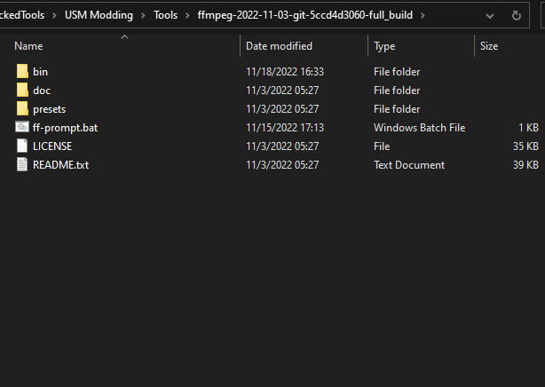
  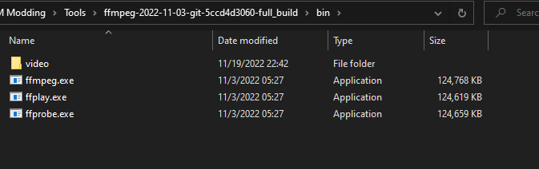
  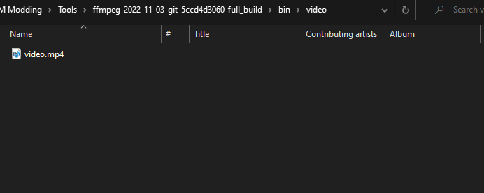
  
   Start ff-prompt.bat. 
  
  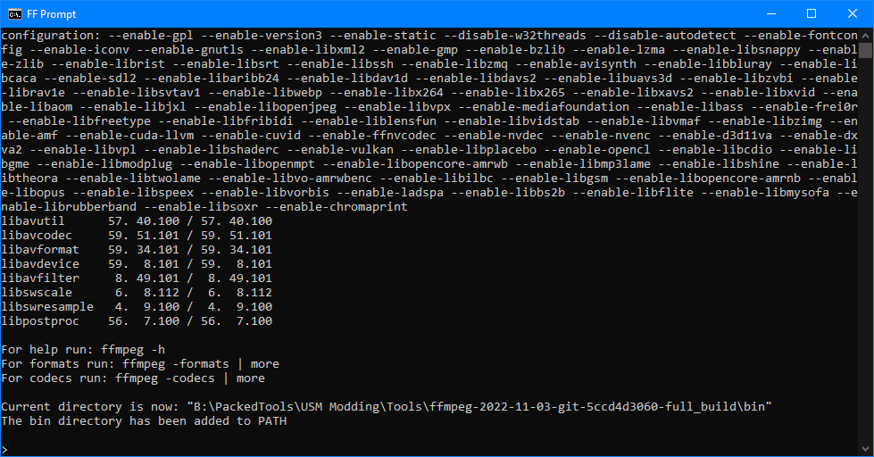
  
   do `ffmpeg -i ./video/video.mp4 ./video/video.wav ./video/video%03d.tga`. ffmpeg will now generate the frames as tga files, and the sound as a wav file. The window should look like something like this when done.
  
  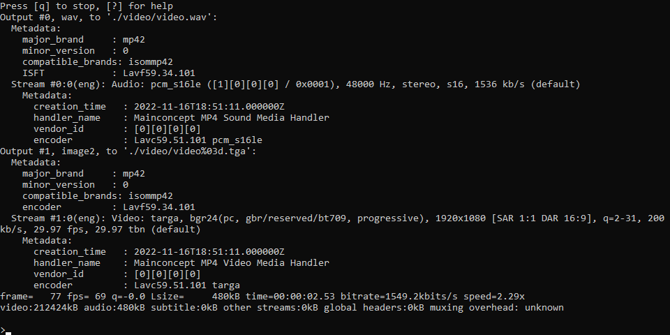
  
   Open Scaleform Video Encoder.
  
  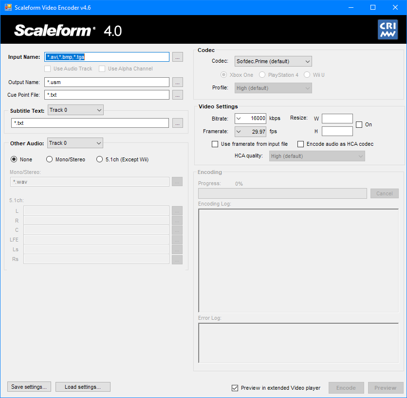
  
   In the "Input Name", select `video001.tga`.
  
  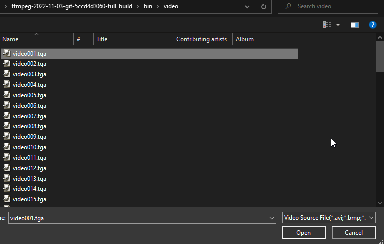
  
   Scroll down to other audio and set it to "Mono/Stereo", and then find and choose `video.wav`.
  
  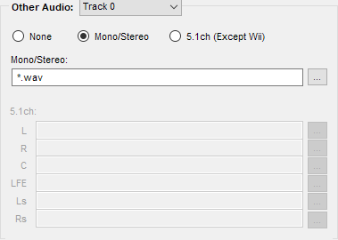
  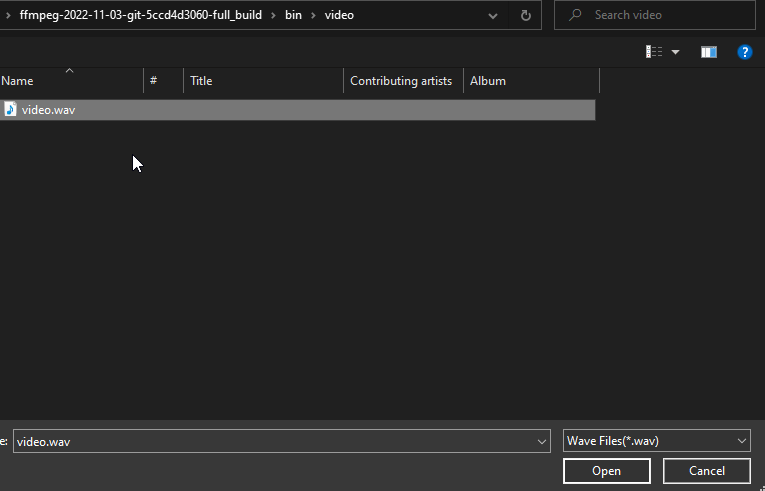
  
   On the right, set your Bitrate to 40000 kbps, and Framerate to 30 fps.
  
  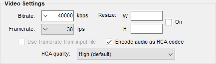
  
!!! warning ***Enable `Encode audio as HCA codec`. or audio will not work.***
    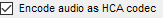
  
  - Press "Encode" at the bottom right of the window. Scaleform will now encode your video into HCA, and it will be located in the same folder as the tga and wav. It will be named `video001.usm`.
  
  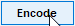
  
  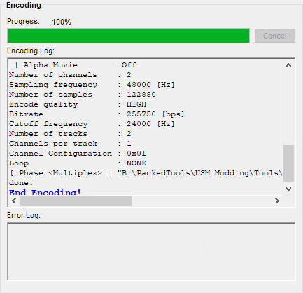
  
  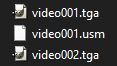
  
   Rename video001.usm to whatever the filename of the USM from the game is. For example, `sonicteam_logo.usm`.
  
  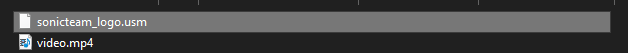
  
   Make a copy of sonicteam_logo.usm and rename the copy to `sonicteam_logo_4k.usm`. (You can make a 4K encode, but it's up to you.)
  
  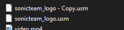
  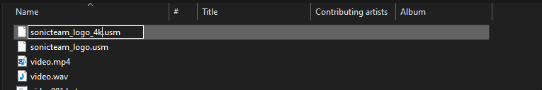
  
   Create a mod in HedgeModManager with the path: "/raw/movie/"
  
  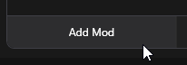
  
  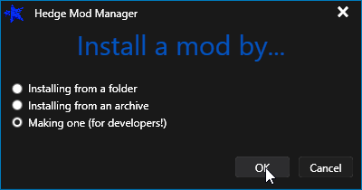
  
  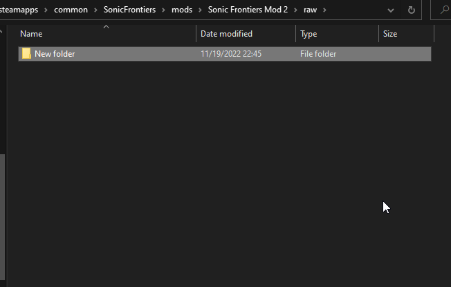
  
  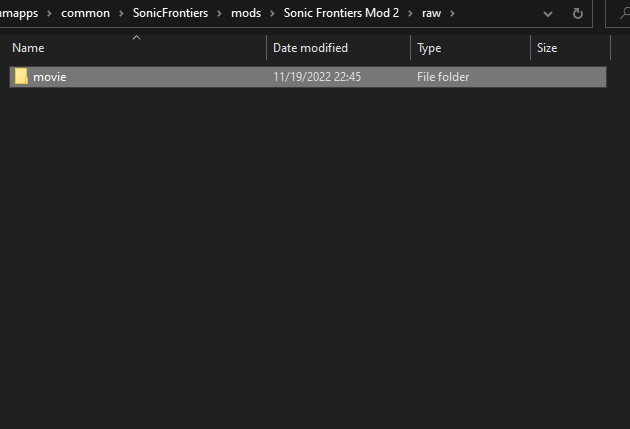
  
   Add both of your USM files to the /movie/ folder. Enable the mod.
  
   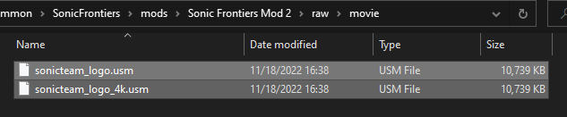
   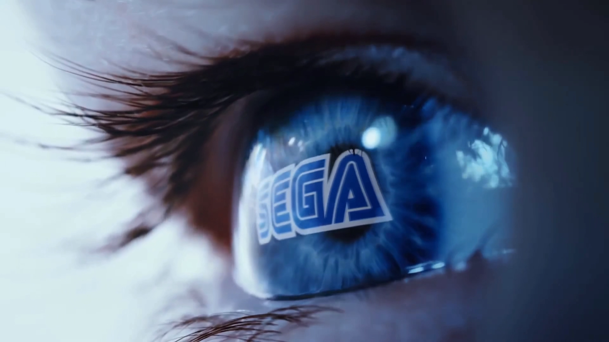
   
