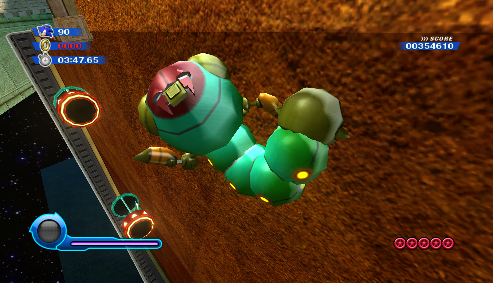

# Unused Objects

## Objects

### AppearThornBall
!!! important
    This section is missing some information. Help us fill it in!

### Shadow
!!! important
    This section is missing some information. Help us fill it in!

### SpinLaserStraightMove
An unused variant of the spinning laser object seen in various levels of Sweet Mountain and Asteroid Coaster.
It moves in a straight line depending on the distance and speed set from the object's parameters.
<video autoplay loop muted defaultmuted playsinline>
  <source src="../assets/unused/spinLaserStraightMove.webm" type="video/webm">
</video>

### SpinLaserPathMove
An unused variant of the spinning laser object seen in various levels of Sweet Mountain and Asteroid Coaster.
It moves along a given path at the speed set from the object's parameters.
<video autoplay loop muted defaultmuted playsinline>
  <source src="../assets/unused/spinLaserPathMove.webm" type="video/webm">
</video>

### RotationGlobe
An unused object meant to be used by the spike wisp in gameplay.
When using a spike wisp the player will be constantly rotated in spin direction of the object whilst in contact with it.
The object has 3 different sizes that it can appear at.
A new variant of this object was made for Sonic Generations Planet Wisp Act 1 called `plaGearFloor`.
<video autoplay loop muted defaultmuted playsinline>
  <source src="../assets/unused/rotationGlobe.webm" type="video/webm">
</video>

## Enemies

### enmMetalSpanner (Metal Thunder Spinner)
An unused, golden variant of the normal enmSpanner (Thunder Spinner) enemy.
Much like the metal variant of enmSpinner (Spinner), this variant of the Thunder Spinner is also indestructable. 
<video autoplay loop muted defaultmuted playsinline>
  <source src="../assets/unused/enmMetalSpanner1.webm" type="video/webm">
</video>
<video autoplay loop muted defaultmuted playsinline>
  <source src="../assets/unused/enmMetalSpanner2.webm" type="video/webm">
</video>

### enmSparva (Thunder Larva)
An unused, electric variant of the normal enmLarva (Larva) enemy.

<video autoplay loop muted defaultmuted playsinline>
  <source src="../assets/unused/enmSparva.webm" type="video/webm">
</video>

### ChaserBomb
* The object makes an appearance in one of the test levels leftover in Sonic Colo(u)rs: Ultimate. 

!!! important
    This section is missing some information. Help us fill it in!

## Cameras

### ObjectLookCamera
An unused camera variant leftover from Sonic Unleashed (HD).
The camera locks onto a targetted object and orbits around it based on the player's position.
<video autoplay loop muted defaultmuted playsinline>
  <source src="../assets/unused/objectLookCamera.webm" type="video/webm">
</video>

## Colliders

### ChageMode_3DtoDash (Event Dimension Change 3D to Dash)
!!! important
    This section is missing some information. Help us fill it in!

### RollerCoasterCollision
* The object makes an appearance in one of the test levels leftover in Sonic Colo(u)rs: Ultimate. 

!!! important
    This section is missing some information. Help us fill it in!

### MotoraEventCollision
An unused collision object to re-spawn defeated Motobugs on demand.
The behaviour is more or less the same as the automatic respawning of the enemy found in Starlight Carnival Act 4.
<video autoplay loop muted defaultmuted playsinline>
  <source src="../assets/unused/motoraEventCollision.webm" type="video/webm">
</video>

## Test Objects

### TestObj
!!! important
    This section is missing some information. Help us fill it in!

### CCTTestObj
!!! important
    This section is missing some information. Help us fill it in!