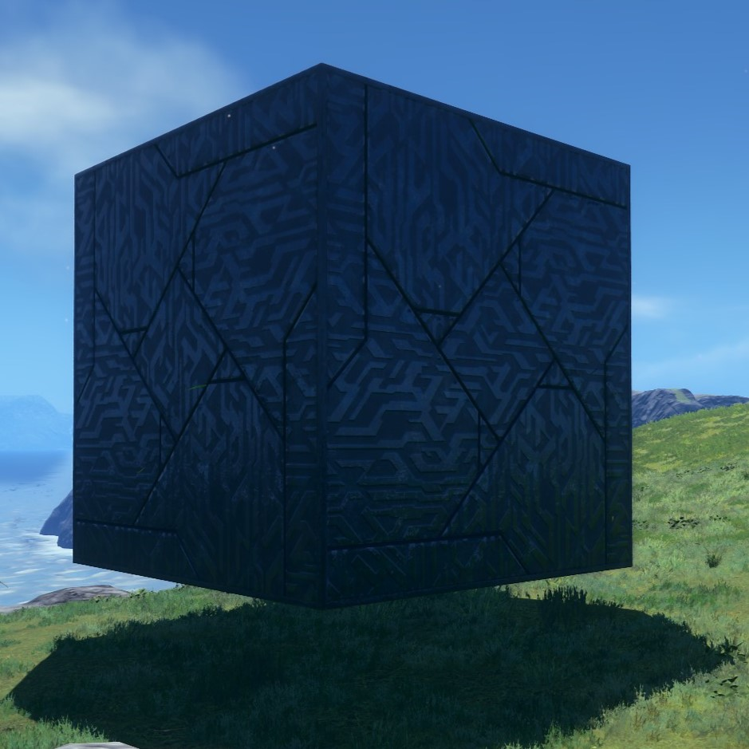

# Gismos

## Islands

### Common

| Information               |   Image                          |
| :------------------------ | :--------------------------------|
| 
`cmnisl_brk_aircontainer` 
 A flying container that breaks upon attack.|{width=150}
| 
`cmnisl_brk_capsule`      
 A capsule that breaks upon attack.|{width=150}
| 
`cmnisl_brk_container01`  
 A container that breaks upon attack.|{width=150}
| 
`cmnisl_brk_container02`  
 A container that breaks upon contact.|{width=150}
| 
`cmnisl_brk_mechabarrel`  
 A barrel that breaks upon attack.|{width=150}
| 
`cmnisl_brk_nonbreakable` 
 An iron box that cannot break.|{width=150}
| 
`cmnisl_brk_standlight01` 
 A light fixture that breaks upon attack.|{width=150}
| 
`cmnisl_brk_standlight02` 
 A light fixture that breaks upon attack.|{width=150}
| 
`cmnisl_brk_watertank`    
 A tank that breaks upon attack.|{width=150}
| 
`cmnisl_gismo_aircubeA`   
 Size A metal cube.|{width=150}
| 
`cmnisl_gismo_aircubeB`   
 Size B metal cube.|{width=150}
| 
`cmnisl_gismo_aircubeC`   
 Size C metal cube.|{width=150}
| 
`cmnisl_gismo_aircubeA3x3`
 Size A metal cube 3x3.|{width=150}
| 
`cmnisl_gismo_aircubeA4x4`
 Size A metal cube 4x4.|{width=150}

### Kronos/Ouranos
!!! important
    This section is missing some information. Help us fill it in!
### Chaos
!!! important
    This section is missing some information. Help us fill it in!
## Cyber Space

### Common
!!! important
    This section is missing some information. Help us fill it in!
### Green Hill
!!! important
    This section is missing some information. Help us fill it in!
### Chemical Plant
!!! important
    This section is missing some information. Help us fill it in!
### Sky Sanctuary
!!! important
    This section is missing some information. Help us fill it in!
### Highway
!!! important
    This section is missing some information. Help us fill it in!