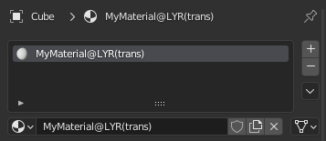
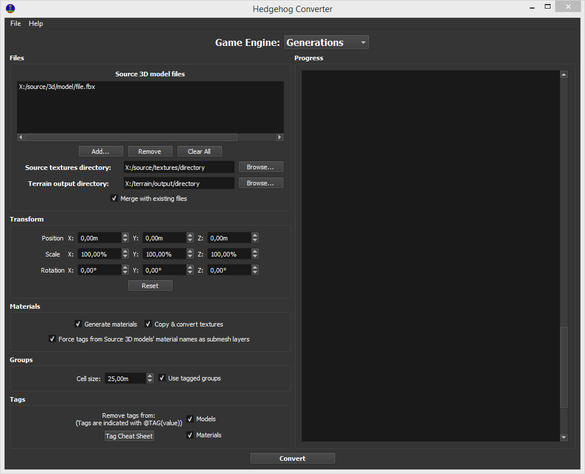
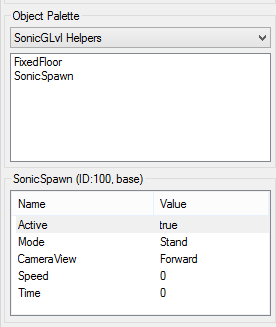

# How To Import Custom Terrain in Sonic Generations
!!! info
    This guide uses the following tools:

    - [Sonic GLvl](/tools/hedgehog-engine/blueblur/levels/#sonicglvl){ target="_blank"}
	- [Blender](https://blender.org){ target="_blank"}
	- [HedgeArcPack](/tools/hedgehog-engine/common/files/#hedgearcpack){ target="_blank"}
    - [PackCpk (From SkythTools)](/tools/general/files/#skythtools)
    - [ModelConverter](/tools/hedgehog-engine/common/models/#modelconverter)
    
#### Part 1 (Creating Terrain in Blender)
First of all, you need terrain for your level. You can do the terrain yourself, or take already created terrain.
If your level contains transparent materials you need to add a proper layer tag to it. For transparency, you have two available layers, and you should pick the one that's best suited for your use case in order to avoid issues.

Layers | Usage
------ |-------
punch  | Used for materials which have binary transparency (one part is 100% opaque, another is 100% transparent). Useful for most kinds of textures, like leaves or grass
trans  | Used for translucent materials, as in, materials which are not 100% opaque but also not 100% transparent (ex. windows)

In order to specify a layer for a material, use the `@LYR` prefix, with the layer name between parenthesis after it.
!!! info "Example"
    

You can then export your terrain from Blender into an Assimp compatible format (FBX, DAE or OBJ work).

#### Part 2 (Importing the Level to the Game)
Download SonicGLvl, and run `bin/HedgehogConverter.exe`. Fill up the following entries:

- Source 3D model files - Your terrain model files
- Source textures directory - Directory containing the texture files of your terrain
- Terrain output directory - Directory which will contain the converted terrain.

Make sure that the folder has a name that matches the target stage you want to replace. For example, for Green Hill Modern, use the folder name `ghz200`.

Be sure to also turn on the following options under "Materials":

- Generate materials
- Copy and convert materials
- Force tags from Source 3D models' material names as submesh layer

In the end, you should have something similar to this:

Next, click the `Convert` button and wait.

#### Part 3 (Getting missing files)
Once the conversion is done, we need to get files that might be missing from your stage.

##### \#stage.ar file
Your stage needs a `\#` file in order to store set-data, collision, and other stage information. We can use the file from the stage we're replacing. If you're replacing Green Hill Modern, go to `disk/bb.cpk` (extract using PackCpk), and copy the `#ghz200.ar.00` and `#ghz200.arl` files into your stage mod files (`disk/bb` folder).

#### Part 4 (Sonic GLvl Basic Setup)

Next up, we need to do some very basic setup of your level's set data in SonicGlvl. Open the app, and open your stage's `#` archive from there. Once the level has been imported into SonicGlvl, press Ctrl+A and then Delete. This will delete all the objects that are present in your level's set data, which are the original objects from the stage we are replacing. Now, find <code style="color: green;">"SonicSpawn"</code> in the objects menu on the left, and place it anywhere you want. This will be where Sonic will spawn in your level. Also, be sure to set the "Active" property to "true" in the settings of the <code style="color: green;">"SonicSpawn"</code> object. 

After that, go to "File" and press "Save Stage Data" and "Save Stage Terrain".

#### Part 4 (Creating Skybox - Optional but Recommended)

Skyboxes in Sonic Generations are just regular .model files. Though not mandatory for the game to boot, they are recommended so that your level at least has a sky for you to look at. You can take these from the original levels or create one yourself.

##### Making one yourself
Export your skybox model from Blender into an Assimp compatible file format. Then, using ModelConverter, drag and drop the model file into the Sonic Generations .bat file. This will generate the .model file, as well as material files. You will need to convert the textures of your skybox manually into the DDS format.

##### Grabbing one from a level
Go to the `Packed` folder in bb/bb2, and open the folder corresponding to the level you want the skybox from. Then, extract the `.ar` archive, and look for the sky's `.model` file. The name should have something to do with "sky". If yo don't manage to find it, look at the stage's `Terrain.stage.xml` file, as it will mention the skybox's model name there. You will need the .model file, the textures (`.dds` files) and the materials of the sky model.

##### Using the Skybox files
After getting the necessary skybox model files, place them inside your stage's `Packed/stageName/stage.ar` file. Then, open `#` file of your stage, and open the <code style="color: green;">Terrain.stg.xml</code> file. You'll need to create a `Sky` tag and write the name of the `.model` file of your skybox, without the extension. Below is an example of how you should write this. In this example, the skybox has a model file named `MySkybox.model`:

This concludes this guide. If you boot your stage now, you'll notice that you will fall through the ground. This is because you only ported the terrain, and not the collision. To do this, follow the guide [here](/guides/hedgehog-engine/blueblur/levels/importing-collision).